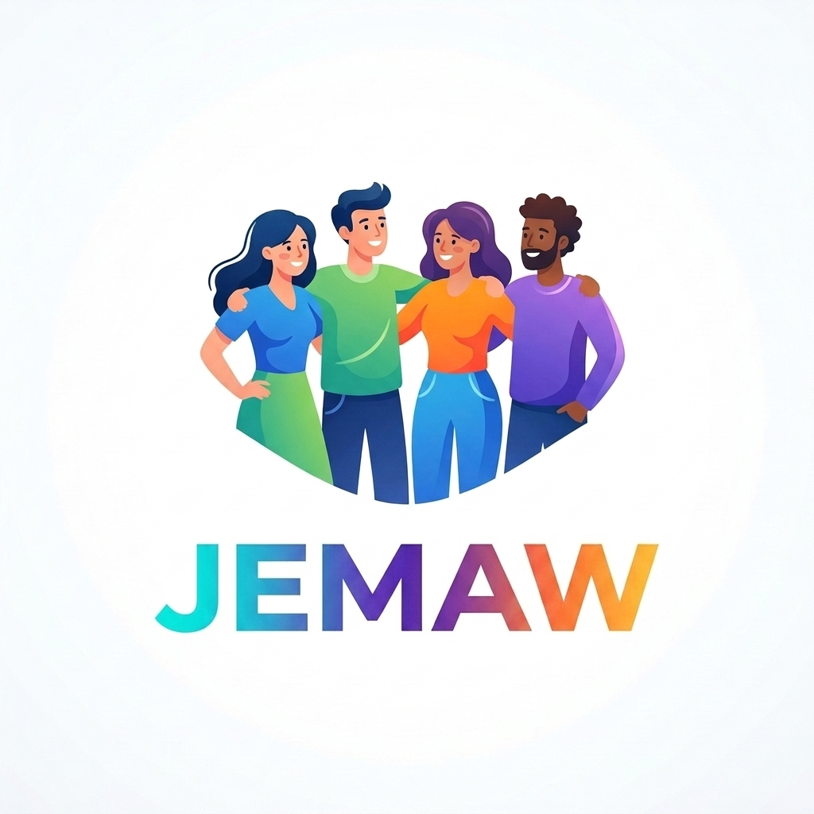

<div align="center">
  

  #  Jemaw

  **Bring your groups together.** <br>
  *Jemaw makes it effortless to coordinate meetups, share memories, track expenses, and stay connected with your favorite people—all powered by intelligent AI assistance and a stunning glassmorphic UI.*

  <br>

  [](https://www.solidjs.com/)
  [](https://tailwindcss.com/)
  [](https://supabase.com/)
  [](https://deepmind.google/technologies/gemini/)

</div>

---

## ✨ Features

- 📱 **Fully Responsive UI**: A beautiful, mobile-first design utilizing frosted glass (glassmorphism) and live dynamic backgrounds (like cinematic neon rain).
- 🔒 **Secure Authentication**: Email and password authentication backed by Supabase Auth.
- 👥 **Group Management**: Create private groups and invite friends using unique 8-character invite codes.
- 💬 **Realtime Chat**: Instant messaging powered by Supabase Realtime channels. Supports message editing, un-sending (deleting), and Markdown formatting for bold text and images.
- 🤖 **AI Chat Summaries**: Missed a lot of messages? Click the Sparkles icon to let Google's Gemini AI summarize the conversation for you instantly.
- 💸 **Expense Splitter**: Keep track of group expenses. Add what you paid, and Jemaw automatically calculates exactly "Who owes whom".
- 🍿 **Cinema Mode**: Instantly jump into a picture-in-picture video call with your group using integrated Jitsi Meet.

## 🚀 The User Flow

1. **Onboarding**: Users sign up or log in via the stunning live-rain auth pages.
2. **Dashboard**: Users are greeted by a centralized dashboard where they can see their active groups.
3. **Joining/Creating**: Users can create a new group or join an existing one by entering a friend's invite code.
4. **Group Hub**: Inside a group, users can seamlessly tab between:
   - **Chat**: Talking in real-time, sending images, or turning on Cinema Mode for video calls.
   - **Expenses**: Logging shared costs and instantly seeing the settlement math.

## 🛠️ Technology Stack

Jemaw is built as a modern monorepo to support future expansion to Desktop and Mobile apps.

- **Frontend**: [SolidJS](https://www.solidjs.com/) (for blazing fast reactivity) + [Tailwind CSS](https://tailwindcss.com/).
- **Backend & Database**: [Supabase](https://supabase.com/) (PostgreSQL).
- **Build Tool**: [Vite](https://vitejs.dev/).
- **AI Integration**: Google Gemini API.

## 📦 Getting Started (Local Development)

### Prerequisites
- Node.js 18+
- A Supabase Project (with the provided SQL migrations executed)
- A Google Gemini API Key

### Installation

1. **Clone the repository:**
   ```bash
   git clone https://github.com/Hailemichale/Jemaw.git
   cd Jemaw
   ```

2. **Install dependencies:**
   ```bash
   npm install
   ```

3. **Set up Environment Variables:**
   Navigate to the web app and create a `.env.local` file:
   ```bash
   cd apps/web
   touch .env.local
   ```
   Add the following keys:
   ```env
   VITE_SUPABASE_URL=your_supabase_project_url
   VITE_SUPABASE_ANON_KEY=your_supabase_anon_key
   VITE_GEMINI_API_KEY=your_gemini_api_key
   ```

4. **Run the development server:**
   From the root of the project, run:
   ```bash
   npm run dev:web
   ```
   Open `http://localhost:5173` in your browser.

## 📱 Coming Soon

We are currently working on deploying Jemaw as a **Windows Desktop App (.exe)** via Tauri, and native **iOS/Android** applications via Capacitor, wrapping our beautiful SolidJS UI into native mobile shells!

---

## 👨‍💻 Author

**HAILEMICHALE LIJALEM**
